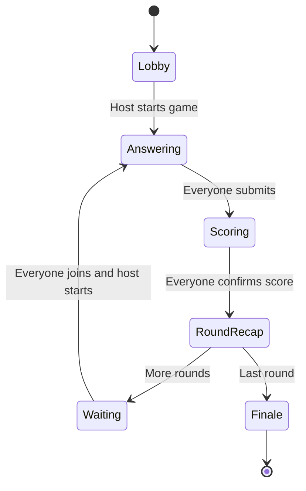

# Game System and Screen Map

## Roles

| Role | Abilities |
| --- | --- |
| Player | Create or reopen a password-free trusted-family profile, change nickname, join an open game, ready up, submit one answer, confirm/override their suggested score, view details and recaps |
| Host | Trusted email-and-nickname access; everything a player can do, plus create rooms, lock contestants, start/reveal/finalize rounds, edit nickname, remove lobby players, and correct scores |
| Master | Everything a host can do, plus promote or demote hosts and view all registered user profiles |

The first master and general-host profiles are assigned their roles and host numbers privately in Firebase after account creation. Only their nicknames are displayed in the game.

## Round state machine



## Requested screens implemented

| Requested screen | Route | Additional behavior |
| --- | --- | --- |
| Welcome / Landing | `#/home` | Funny disclaimer, instructions, host login, main join button, account creation |
| Instructions | `#/instructions` | Six-step rules and matching explanation |
| Player Login / Signup | `#/auth` | Immediate email-plus-nickname match, automatic new-player routing, editable nickname, no password |
| Host Login / Dashboard | `#/host` | Email-plus-nickname entry, host number, resume game, create game, master controls |
| Create New Game | `#/create` | Nickname, rounds, host participation, optional two-to-four-team setup, answer source, generated game code |
| Join Game | `#/join` | Six-character room code lookup |
| Player Game Welcome | `#/game/:id/lobby` | Player list, readiness, room details |
| Host Game Welcome | same route | Start Game, settings, details, locked player list |
| Main Game / Round | `#/game/:id/play` | Prompt, answer draft, double-confirm final answer, submission progress |
| Answer Reveal / Score Confirmation | same route | Seven ranked answers, automatic suggested points, player override and final score submit |
| Round Recap | automatic game state | Question, answer board, every player answer and score, winner spotlight, confetti, and fanfare |
| Game Recap | `#/game/:id/recap` | Sorted leaderboard, round wins, next-round readiness gate |
| Game Details | `#/game/:id/details` | Totals, players, round carousel, leaderboard |
| Round Details | `#/game/:id/round-details` | Round carousel, source/fetch time, answers, player guesses and scores |
| Host Settings | `#/game/:id/settings` | Nickname, remove lobby player, edit finalized per-round scores |
| Finale | `#/game/:id/finale` | Individual and optional team champions, co-winner treatment, confetti, final standings, play again |
| Hall of Fame | `#/hall-of-fame` | Six lifetime categories, trophy celebrations, records, and clickable player cards |
| Master User Controls | `#/admin` | Registered users, host promotion, assigned host number |

Each game stores a host-adjustable answer timer (30 seconds by default). Every round receives a shared deadline. At zero, active contestants submit whatever is currently typed, missing contestants receive `No answer`, and the host client advances the room to the answer reveal. Readiness panels identify who is ready, answering, score-confirmed, or waiting for the next round.

## Optional teams mode

The host can enable two, three, or four teams while creating a game and provide initial names such as `Team #1`. Every contestant—including a playing host—must choose a valid team in the lobby before the game can start. Team assignments lock when the game begins.

Each contestant still answers, scores, ranks, wins rounds, and builds lifetime statistics as an individual. Team standings are an additional calculation: every member's finalized individual points are summed into the team total. Round recaps show each team's contribution, and the finale celebrates the highest-scoring team alongside the individual champion. Ties create co-champion teams.

Any contestant in that game or the host can rename a team from the synchronized team scoreboard at any time, including after the game starts. Team names never affect stored individual results.

## Hall of Fame and lifetime records

Every finished game contributes once to each contestant's lifetime record. Reopening the Hall of Fame as a host safely synchronizes completed games owned by that host; master access can backfill every completed game. Repeated synchronization replaces the stored summary for the same game rather than counting it twice.

The six championship categories are most lifetime points, most rounds played, most rounds won, highest average points per round, highest score in one game, and most scoring rounds won in a row. Ties create co-champions. An all-zero round does not count as a round win.

Player cards expose only nicknames and gameplay statistics. Email addresses remain in the private profile area and are never copied into Hall of Fame data.

## Matching and points

Answers are normalized by:

1. converting to lowercase;
2. removing accent marks;
3. treating `&` as “and”;
4. removing non-word punctuation;
5. collapsing repeated spaces;
6. checking exact full-query and suffix matches;
7. allowing approximately 20% spelling/edit tolerance on the player's missing-word completion, including adjacent-letter transpositions.

The fuzzy comparison deliberately excludes the shared question text so two unrelated short answers cannot match merely because their prompt is identical. Very short completions remain exact-only. Live provider results are also rejected unless they begin with the exact normalized prompt, and duplicate completion suffixes are removed before a seven-answer board is accepted.

The point schedule is deliberately highest-first:

| Suggestion rank | Points |
| ---: | ---: |
| 1 | 10 |
| 2 | 7 |
| 3 | 5 |
| 4 | 4 |
| 5 | 3 |
| 6 | 2 |
| 7 | 1 |
| No match | 0 |

The player sees this automatic suggestion but may select any valid score when the room agrees. The host can make a later correction from Host Settings; the game adjusts the total by the difference.

## Realtime data outline

```text
admins/{uid}                         Secure master flags
loginLookup/{normalizedHash}         Email-plus-nickname lookup without exposing raw values in the path
sessions/{firebaseAnonymousUid}      Current device session mapped to a stable player profile
users/{profileId}                    Display name, email, provider, role, host number
meta/nextGameNumber                  Sequential display number
gameCodes/{sixCharacterCode}         Room-code lookup
userGames/{uid}/{gameId}             User-to-game history index
leaderboard/{uid}                    Best completed-game score for each player
playerStats/{uid}                    Public nickname and aggregated gameplay statistics
  gameSummaries/{gameId}             Idempotent per-game totals and round-win pattern
games/{gameId}
  hostUid, nickname, code, settings, teamMode
  teams/{teamId}                     Synchronized editable team name
  players/{uid}                      Totals, round-win counts, and optional teamId
  lobbyReady/{uid}
  questionQueue/{index}
  rounds/{number}
    prompt, query, suggestions, source
    answers/{uid}
    scoreClaims/{uid}
    results/{uid}
  ready/{nextRound}/{uid}
```

## Design system

- Palette: midnight navy, indigo, electric violet, cyan, gold, and restrained coral.
- Type: rounded display lettering for game-show energy; neutral sans-serif for forms and score details.
- Contrast: answer-entry surfaces remain dark and quiet; celebratory colors intensify during reveals and the finale.
- Motion and sound: stage glow, answer-board flips, round-winner rays, confetti, generated Web Audio cues, and finale fanfare. Reduced-motion preferences disable nonessential animation, and sound can be switched off at any time.
- Layout: phone-first single-column play screens; two-column host/detail screens on larger displays.
- Originality: custom generated stage art, custom SVG icon, code-native UI graphics, and no copied game-show or Google visual assets.
